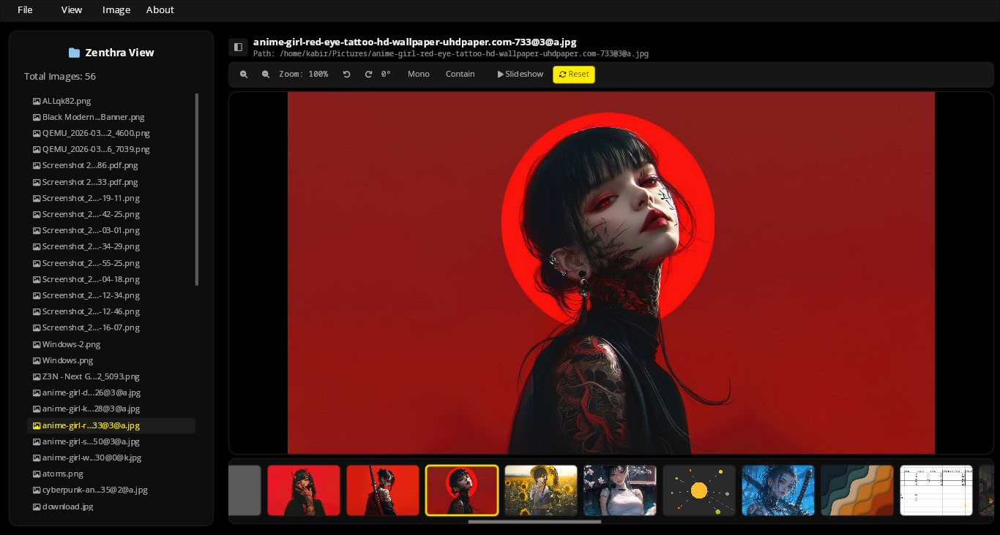
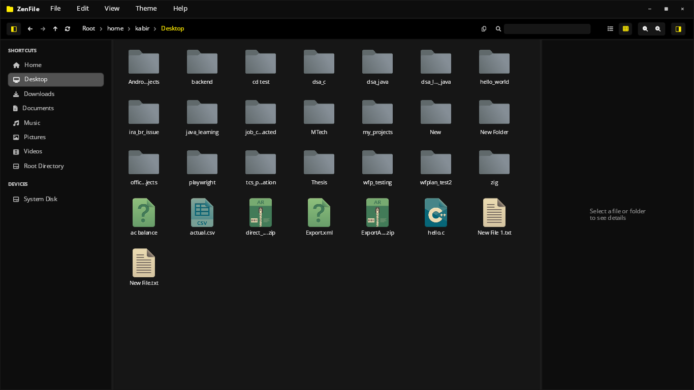

# Zenthra

A high-performance, immediate-mode UI framework written in Rust. Zenthra is built from scratch with a custom GPU render pipeline, a flexible layout engine, and a widget system designed for speed and ergonomics.

🌐 **Website:** [zenthralabs.com](https://zenthralabs.com)  
📖 **Documentation:** [zenthralabs.com/products/zenthra/docs/](https://zenthralabs.com/products/zenthra/docs/)

---

## Showcase

Here are some native applications built entirely with the Zenthra framework:

### Zenthra View (Native Image Viewer)


### ZenFile (Native File Manager)


---

## Features

- **GPU-Accelerated Rendering** — Rect, text, and overlay draw commands sent directly to the GPU via WGPU.
- **Immediate-Mode API** — Rebuilds the UI each frame for instant state transitions and zero-synchronization overhead.
- **Flexible Layout Engine** — Row, Column, and Wrap layouts with alignment, padding, and gap support.
- **High-Performance Virtualization** — `LazyContainer` renders only visible items, handling millions of rows at a constant 60 FPS.
- **Premium Glassmorphism** — Built-in hardware-accelerated Dual-Pass Kawase blur, frosted grain overlays, and beveled specular edge highlights.
- **Extensible WGSL Shaders** — Dynamically load and run developer-registered fragment shaders on layout containers with ease.
- **Scrollable Containers** — Out-of-the-box scrollbar drag, mouse wheel, and trackpad gestures.
- **Text System** — Powered by [cosmic-text](https://github.com/pop-os/cosmic-text) with full shaping, bidirectional text, and font fallback.
- **Input Widgets** — Single-line `Input` and multi-line `TextArea` with cursor tracking, selection, and virtual scrolling.

---

## Quick Start

Add `zenthra` to your dependencies in `Cargo.toml`:

```toml
[dependencies]
zenthra = "0.1.2"
```

Create a minimal application in `src/main.rs`:

```rust
use zenthra::prelude::*;

fn main() {
    App::new()
        .title("My App")
        .size(800, 600)
        .with_ui(|ui| {
            ui.text("Hello, Zenthra!")
                .size(32.0)
                .color(Color::WHITE)
                .show();
        })
        .run();
}
```

---

## Examples

Run the built-in examples to see widgets and layouts in action:

```bash
# Basic window
cargo run --example hello

# Glassmorphism & layout tab panels
cargo run --example glassmorphism_demo

# Custom WGSL post-processing shaders
cargo run --example custom_shader_demo

# Standard containers
cargo run --example containers
```

---

## Widgets

| Widget | Description |
|---|---|
| `container()` | Layout box with padding, background, corner radius, scrolling, and custom shaders |
| `lazy_container()` | Virtualized container — only renders visible items |
| `text()` | Styled text with font size, color, and paragraph alignment |
| `button()` | Interactive button with hover/active states |
| `input()` | Single-line text input field |
| `text_area()` | Multi-line text editor |

Full API reference can be found in [`docs/widget-guide.md`](docs/widget-guide.md).

---

## Architecture

See [`docs/architecture.md`](docs/architecture.md) for a detailed overview of the layout lifecycle, rendering pipelines, and state management.

---

## License

Apache 2.0 — see [LICENSE](LICENSE).
